# Provably Robust Boosted Decision Stumps and Trees against Adversarial Attacks 

<p align="center">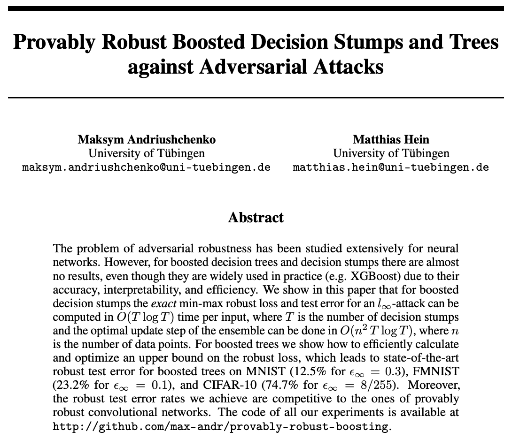</p>

**NeurIPS 2019**

**Maksym Andriushchenko, Matthias Hein**

**University of Tübingen**

**Paper:** [http://arxiv.org/abs/1906.03526](http://arxiv.org/abs/1906.03526)


This repository contains a mini-library for training provably robust boosted decision 
stumps and trees written in `python`. Thus, it is easy to modify and experiment with this code, unlike
the code of `xgboost` or `lightgbm` which are implemented in `C++`.
To foster reproducible research, we also provide code for all main experiments 
reported in the paper (see `exps.sh`). 
Moreover, we also provide code for all figures shown in the paper, each as a separate Jupyter notebook 
(see folder `notebooks`). 
All dependencies are collected in `Dockerfile`.

**Models:** All our provably robust models (stumps and trees) are publicly available by 
[this link](https://drive.google.com/open?id=15p2ihucMVfNXEmqZBJYYvPHDeQjBixV6)
including our MNIST, FMNIST, and CIFAR-10 models. 

**Version 2.0 of the repository (corresponds to the NeurIPS'19 camera-ready version):**
- multi-class extension
- significant speed-up via a parallel tree construction and parallel fitting of stumps to different coordinates
- fixed memory leak issues due to `numba`
- improved efficiency of individual tree predictions and certification using `numba`


## Main idea of the paper
We propose provable defenses against adversarial attack for boosted decision stumps and trees.
Here is the effect of our method on a 2D dataset.
<p align="center">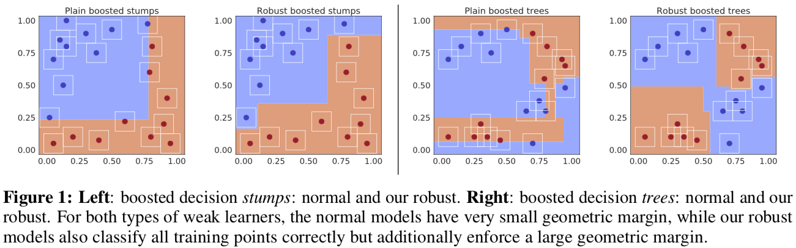</p>


## Provably robust training
We follow the framework of robust optimization aiming at solving the following min-max problem:
<p align="center">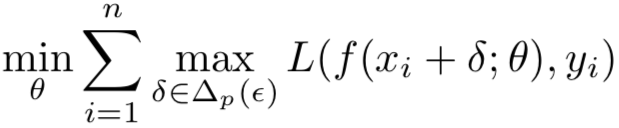</p>

We first derive the robustness certificates. The certification for boosted stumps is exact:
<p align="center">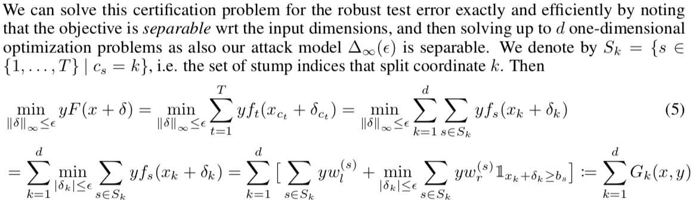</p>
For boosted trees, we derive a simple lower bound on the functional margin which, however, 
becomes tight after robust training.
<p align="center">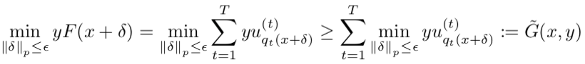</p>

Then we integrate these certificates into training which leads to the exact robust loss or to an upper bound on 
the robust loss for stumps and trees respectively.

How we minimize these robust losses? Surprisingly, it results in a **convex optimization problem** wrt the parameters of 
the stumps or trees. We use coordinate descent combined with bisection to solve for w_r and w_l. 
For more details, see the paper.


## Experiments
Experimental results show the efficiency of the robust training methods for boosted stumps and
boosted trees:
<p align="center">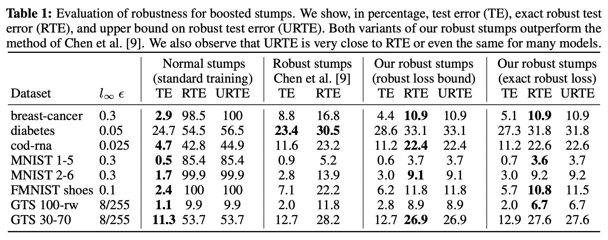</p>
<p align="center">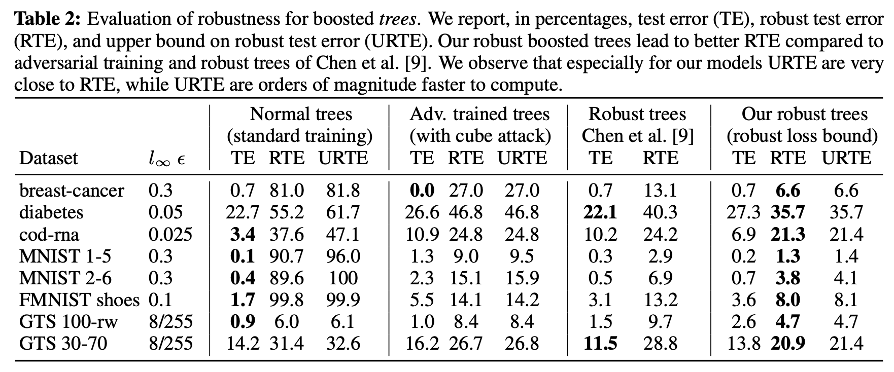</p>

Moreover, although decision trees as weak learners are obviously not suitable for computer vision tasks, our robust 
boosted trees nonetheless show provable robustness **competitive to provably robust CNNs** outperforming almost all 
proposed in the literature approaches:
<p align="center">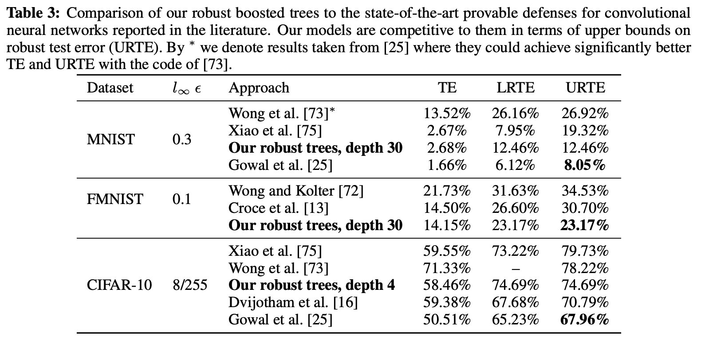</p>


## Effect of robust training
The effect of robust training can be clearly seen based on the splitting thresholds 
that robust models select
<p align="center">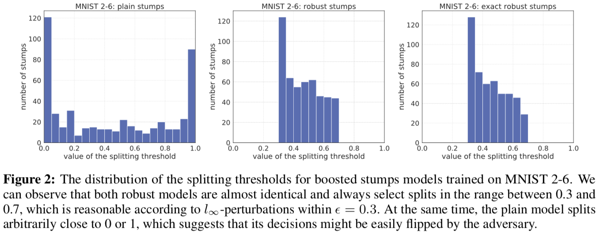</p>


## Exact adversarial examples
Using our exact certification routine, we can also *efficiently* (without any combinatorial solvers) find provably 
minimal (exact) adversarial examples wrt Linf-norm for boosted stumps:
<p align="center">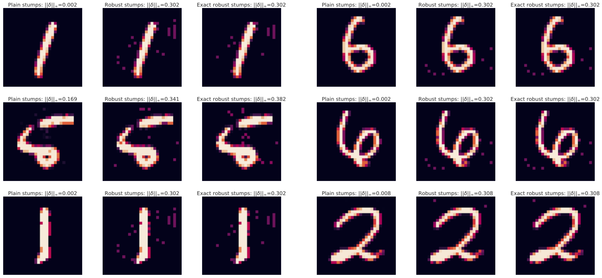</p>


## Interpretability
One of the main advantages of boosted trees is their interpretability and transparent decision making.
Unlike neural networks, tree ensembles can be directly visualized based on which features they actually use 
for classification. Here is an example of our provably robust boosted trees on MNIST 2 vs 6:
<!-- 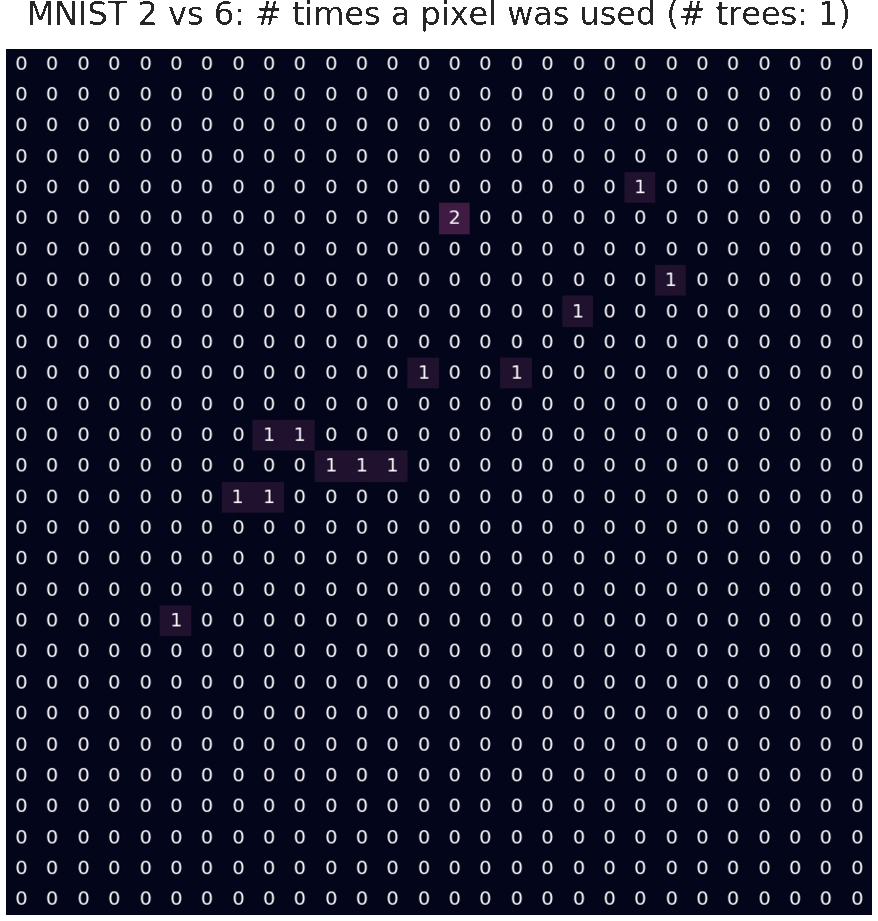 -->
<p align="center"></p>


## Code for training provably robust boosted stumps and trees


### Simple example
```python
import numpy as np
import data
from tree_ensemble import TreeEnsemble

n_trees = 50  # total number of trees in the ensemble
model = 'robust_bound'  # robust tree ensemble
X_train, y_train, X_test, y_test, eps = data.all_datasets_dict['breast_cancer']()
X_train, X_test = data.convert_to_float32(X_train), data.convert_to_float32(X_test)

# initialize a tree ensemble with some hyperparameters
ensemble = TreeEnsemble(weak_learner='tree', n_trials_coord=X_train.shape[1], 
                        lr=0.01, min_samples_split=10, min_samples_leaf=5, max_depth=4, 
                        max_weight=1.0, idx_clsf=0)
# initialize gammas, per-example weights which are recalculated each iteration
gamma = np.ones(X_train.shape[0])
for i in range(1, n_trees + 1):
    # fit a new tree in order to minimize the robust loss of the whole ensemble
    weak_learner = ensemble.fit_tree(X_train, y_train, gamma, model, eps, depth=1)
    margin_prev = ensemble.certify_treewise(X_train, y_train, eps)  # needed for pruning
    ensemble.add_weak_learner(weak_learner)
    ensemble.prune_last_tree(X_train, y_train, margin_prev, eps, model)
    # calculate per-example weights for the next iteration
    gamma = np.exp(-ensemble.certify_treewise(X_train, y_train, eps))
    
    # track generalization and robustness
    yf_test = y_test * ensemble.predict(X_test)
    min_yf_test = ensemble.certify_treewise(X_test, y_test, eps)
    if i == 1 or i % 5 == 0:
        print('Iteration: {}, test error: {:.2%}, upper bound on robust test error: {:.2%}'.format(
            i, np.mean(yf_test < 0.0), np.mean(min_yf_test < 0.0)))
```
```
Iteration: 1, test error: 2.92%, upper bound on robust test error: 10.95%
Iteration: 5, test error: 2.92%, upper bound on robust test error: 10.95%
Iteration: 10, test error: 2.19%, upper bound on robust test error: 10.22%
Iteration: 15, test error: 2.19%, upper bound on robust test error: 10.22%
Iteration: 20, test error: 2.19%, upper bound on robust test error: 10.22%
Iteration: 25, test error: 2.19%, upper bound on robust test error: 10.22%
Iteration: 30, test error: 1.46%, upper bound on robust test error: 8.03%
Iteration: 35, test error: 1.46%, upper bound on robust test error: 8.03%
Iteration: 40, test error: 1.46%, upper bound on robust test error: 7.30%
Iteration: 45, test error: 1.46%, upper bound on robust test error: 7.30%
Iteration: 50, test error: 0.73%, upper bound on robust test error: 6.57%
```


### Full training
One can train robust stumps or trees using `train.py`.  The full list of possible arguments is 
available by `python train.py --help`. 

Boosted stumps models:
- `python train.py --dataset=mnist_2_6 --weak_learner=stump --model=plain`  
- `python train.py --dataset=mnist_2_6 --weak_learner=stump --model=at_cube --lr=0.01`  
- `python train.py --dataset=mnist_2_6 --weak_learner=stump --model=robust_bound`
- `python train.py --dataset=mnist_2_6 --weak_learner=stump --model=robust_exact`

Boosted trees models:
- `python train.py --dataset=mnist_2_6 --weak_learner=tree --model=plain --lr=0.2`  
- `python train.py --dataset=mnist_2_6 --weak_learner=tree --model=at_cube --lr=0.2`  
- `python train.py --dataset=mnist_2_6 --weak_learner=tree --model=robust_bound --lr=0.2`

Note that Linf epsilons for adversarial attacks are specified for each dataset separately in `data.py`.

See more examples how to train our models on different datasets and in different settings in `exps.sh`.


### Evaluation
`eval.py` and `notebooks/adv_examples.ipynb` show how one can restore a trained model in order to evaluate it (e.g., 
calculate the robustness bounds or to show the adversarial examples).

In order to evaluate the boosted tree models using MILP, we refer to [this repository](https://github.com/chenhongge/RobustTrees).


### Jupyter notebooks to reproduce the figures
- `notebooks/toy2d.ipynb` - Figure 1: toy dataset which shows that the usual training is non-robust, while our robust models
can robustly classify all training points.
- `notebooks/minmax_objective.ipynb` - Figure 2: visualization of the min-max objective which is convex wrt its parameters.
- `notebooks/model_analysis.ipynb` - Figures 3, 8, 9, 10: histograms of splitting thresholds, where we can observe a clear effect of 
robust training on the choice of the splitting thresholds. Also: Figures 5, 6, 7 show the feature importance plots based
on the number of times some feature was used for a split.
- `notebooks/robustness_generalization.ipynb` - Figure 4: the robustness vs accuracy trade-off.
- `notebooks/adv_examples.ipynb` - Figures 11, 12, 13: exact adversarial examples for boosted stumps, 
which are much larger in Linf-norm for robust models. 


### Dependencies
All dependencies are collected in `Dockerfile`.
The best way to reproduce our environment is to use Docker. Just build the image and then run the container:
- `docker build -t provably_robust_boosting .`
- `docker run --name=boost -it -P -p 6001:6001 -t provably_robust_boosting`


### Faster training
Running the code on small- and middle-scale datasets should be fast, however large-scale datasets 
(especially with many classes) may need some time to train. 
In case you want to get results faster, there are several options to speed up the training:
- **Check fewer thresholds**: You can try to subsample the number of thresholds by using the option `--n_bins=k`. 
This approach comes with no guarantees, but based on our experience it does not sacrifice the robust 
accuracy for a *reasonably chosen* `k`, and can save a lot of computations.
- **Parallelization over features**: The number of processes for this is determined automatically in 
function `get_n_proc(n_ex)` from `utils.py`. You can adapt this number according to the number of features in 
your dataset, and the number of available CPU cores.
- **Parallelization over tree construction**: The tree construction is also parallelized, see `def fit_tree(self, X, y, gamma, model, eps, depth)`.
You might need to adapt the depth limit under which the tree construction is parallelized, i.e. instead of the default
value of `4` in line `if parallel and depth <= 4:`, you can increase or reduce this number. Again, it depends on your 
hardware, the total depth, and the dataset, so it's hard to give a general advice. We recommend to change this value
in a way that would maximize the CPU utilization.
- **Parallelization over thresholds**: This can help if you have a few features, and many thresholds to check. You can 
set `parallel = True` at the top of `robust_boosting.py`, which would turn on the parallelization over thresholds 
(due to `numba` library). However, then you have to disable all other parallelization methods (i.e. over features and over 
tree construction, both are in `tree_ensemble.py`, just set `parallel = False` in `fit_tree()` and `fit_stumps_over_coords()`) 
which conflict with `numba`.


## Contact
Do you have a problem or question regarding the code?
Please don't hesitate to open an issue or contact [Maksym Andriushchenko](https://github.com/max-andr) directly.
We would also like to hear from you if you find the code useful in some applications.


## Citation
```
@article{andriushchenko2019provably,
  title={Provably Robust Boosted Decision Stumps and Trees against Adversarial Attacks},
  author={Andriushchenko, Maksym and Hein, Matthias},
  conference={Advances in Neural Information Processing Systems},
  year={2019}
}
```